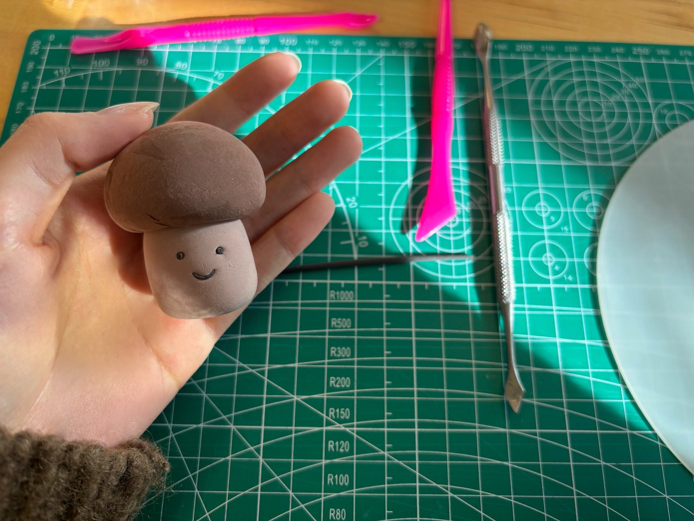

## 🌈 Welcome to Air-dry Clay Workshop! 🌈#
Hey there, creative souls! 🎨✨ 

Are you ready to dive into the magical world of Air-dry clay? Let's get our hands dirty and make some art! 🥳🥳

##  ✨Preparation:
- Ai-dry Clay
- Mat
- Modeling tools
- Ziplock bags

    

##   ✨Shaping
- Take out the clay.
- Use a ziplock bag to seal the excess clay to prevent it from drying out.
    

- Use your hands or a board to knead and roll it into a ball. (Using a board can reduce fingerprints)
    
    
    
    
- Knead or roll it into a cylinder.
    
    

- Press down on the cylinder to adjust its height, making the top and bottom surfaces of the cylinder flat.

    
    

- Adjust the shape.
    

- Take out the clay in different color.
- Use hands or tools to adjust the shape like previous steps.
    

##  ✨Assemble
- Score the top side with a needle tool or fork （this can make the two parts stick together more tightly.）

    

- Connect the two parts together.
    

##  ✨Make details

- Use a tool to drill small hole to make eyes and a mouth.
    

- Use hands or tools to knead the mud into thin strips, and cut out eyes and mouth.
    
    

- Assemble the eyes, mouth, and body together.
    

##  ✨Coat (optional)
- If you prefer a smooth surface, you can use UV resin after the clay has dried.
    

- Below is a comparison between applying UV resin and not using UV resin.
    

## ✨Finish
🎉 Congratulations, you've reached the final stage of our Air-dry clay workshop! 

In the end, you can:
- Attach a magnet to the back to turn it into a fridge magnet.
- Make it into a keychain, an ornament, and so on.
    

